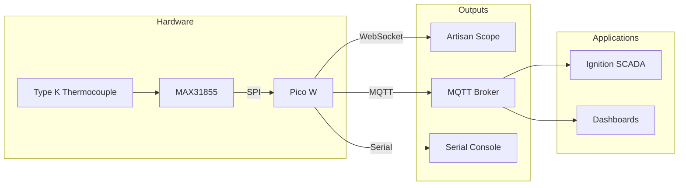
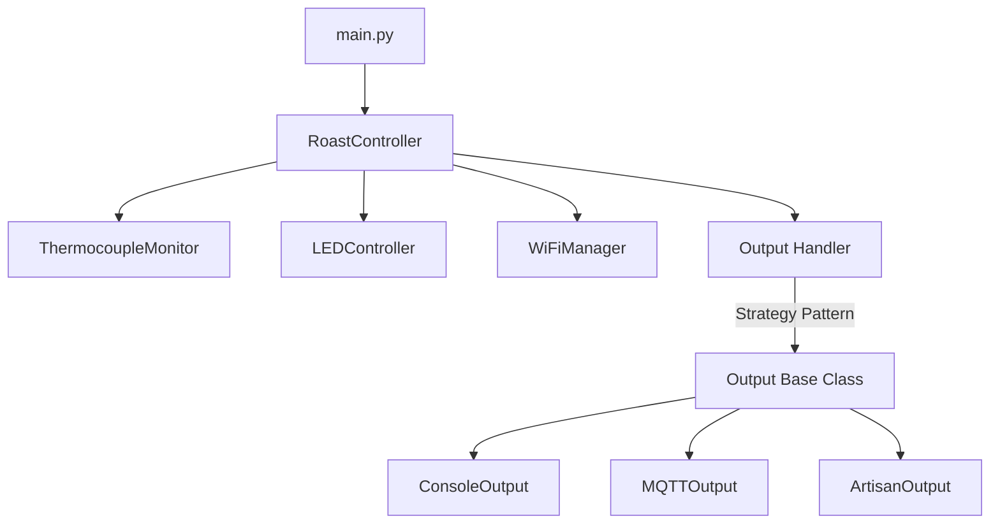
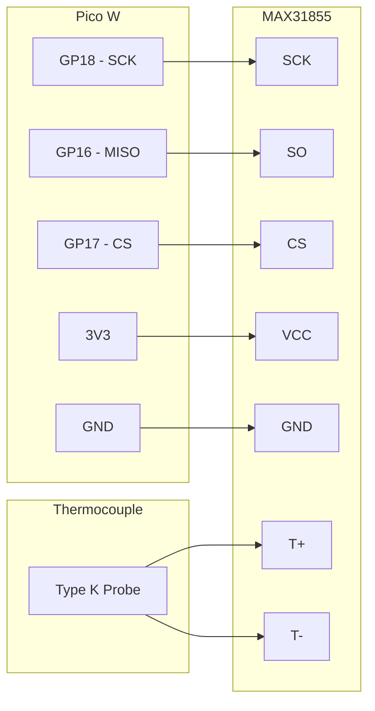

# Ignition Coffee Lab (ICL)

A coffee roasting automation platform using Raspberry Pi Pico W for real-time temperature monitoring, with integrations for Artisan Scope and industrial SCADA systems.

## Features

- **Real-time Temperature Monitoring** via MAX31855 thermocouple
- **Artisan Scope Integration** through WebSocket server
- **MQTT Publishing** for SCADA and automation systems
- **Robust WiFi** with auto-reconnection and cold-boot handling
- **Visual Feedback** via LED status patterns

## System Architecture



## Software Architecture



## Quick Start

See the **[Quick Start Guide](docs/QUICKSTART.md)** for step-by-step setup instructions.

## Hardware

### Requirements

| Component | Purpose | Approx. Cost |
|-----------|---------|--------------|
| Raspberry Pi Pico W | Microcontroller with WiFi | $6 |
| MAX31855 Breakout | Thermocouple amplifier (SPI) | $15 |
| Type K Thermocouple | High-temp sensor (-200°C to 1350°C) | $10-30 |
| Breadboard + Wires | Prototyping | $5 |

### Wiring

| Pico W Pin | MAX31855 Pin | Function |
|------------|--------------|----------|
| GP18 | SCK | SPI Clock |
| GP16 | SO (MISO) | SPI Data |
| GP17 | CS | Chip Select |
| 3V3 | VCC | Power |
| GND | GND | Ground |



## Configuration

### settings.toml

```toml
# WiFi (required)
WIFI_SSID = "YourNetwork"
WIFI_PASSWORD = "YourPassword"

# CircuitPython Web Workflow (optional - enables remote file access)
CIRCUITPY_WIFI_SSID = "YourNetwork"
CIRCUITPY_WIFI_PASSWORD = "YourPassword"
CIRCUITPY_WEB_API_PASSWORD = "your_api_password"

# MQTT (for SCADA integration)
MQTT_BROKER = "192.168.1.100"
MQTT_PORT = "1883"
MQTT_TEMP_TOPIC = "icl/roast_monitor/pico01/temperature"
MQTT_STATUS_TOPIC = "icl/roast_monitor/pico01/status"

# Artisan WebSocket
WEBSOCKET_HOST = "0.0.0.0"
WEBSOCKET_PORT = 8765
```

### main.py Options

| Setting | Values | Description |
|---------|--------|-------------|
| `OUTPUT_MODE` | `"artisan"`, `"mqtt"`, `"console"` | Where to send temperature data |
| `PREFERRED_TEMP_UNIT` | `"C"`, `"F"` | Temperature unit for output |
| `READ_INTERVAL` | float (seconds) | Time between readings (default: 1.0) |
| `DEBUG_MODE` | `True`, `False` | Enable verbose logging |

## Output Modes

### Artisan Scope (WebSocket)

The Pico W runs a WebSocket server that Artisan connects to.

**Setup in Artisan:**
1. Config → Device → WebSocket
2. URL: `ws://[pico_ip]:8765`
3. Set BT (Bean Temperature) to input1

**Data Format:**
```json
{"id": 1, "data": {"temp1": 150.5, "temp2": 0.0}}
```

### MQTT

Publishes temperature readings to an MQTT broker.

**Topic Structure:**
```
icl/roast_monitor/[device_id]/temperature
icl/roast_monitor/[device_id]/status
```

**Temperature Payload:**
```json
{
  "temperature_c": 150.5,
  "temperature_f": 302.9,
  "timestamp": 1699123456.78,
  "device_id": "pico01",
  "is_valid": true
}
```

### Console

Prints readings to serial console for debugging.

## LED Status Codes

| Pattern | Meaning |
|---------|---------|
| Short-short-pause (repeating) | Initializing / Connecting to WiFi |
| 3 blinks → solid 3s | Successfully connected |
| Quick single blink | Temperature reading sent |
| Fast continuous blinking | Error (check serial console) |
| Off | Normal operation |

## Project Structure

```
ignition-coffee-lab/
├── README.md
├── CLAUDE.md                      # Claude Code instructions
├── docs/
│   └── QUICKSTART.md              # Setup guide
└── raspberry-pi-pico/
    ├── main.py                    # Entry point
    ├── settings.toml              # Configuration
    ├── roast_monitor/
    │   ├── controller.py          # Main orchestrator
    │   ├── thermocouple.py        # MAX31855 interface
    │   ├── outputs/
    │   │   ├── base.py            # Abstract output class
    │   │   ├── console.py         # Serial output
    │   │   ├── mqtt.py            # MQTT publishing
    │   │   └── artisan.py         # WebSocket server
    │   └── utils/
    │       ├── led.py             # LED controller
    │       └── wifi.py            # WiFi manager
    └── lib/                       # CircuitPython libraries
        ├── adafruit_max31855.mpy
        ├── adafruit_minimqtt/
        └── asyncio/
```

## Adding Custom Output Handlers

Create a new output by subclassing `Output`:

```python
# roast_monitor/outputs/custom.py
from .base import Output

class CustomOutput(Output):
    def requires_wifi(self) -> bool:
        return True

    def initialize(self, wifi_manager=None) -> bool:
        # Setup code
        return True

    def output_reading(self, reading: dict) -> bool:
        temp_c = reading["temp_celsius"]
        temp_f = reading["temp_fahrenheit"]
        # Send data somewhere
        return True

    def output_status(self, status: dict) -> bool:
        return True

    def cleanup(self):
        pass
```

Register in `outputs/__init__.py` and add to `output_handlers` dict in `main.py`.

## Troubleshooting

| Issue | Cause | Solution |
|-------|-------|----------|
| "No network with that ssid" on boot | WiFi radio cold start | Fixed in code with radio warmup; ensure 2.4GHz network |
| LED stuck on init pattern | WiFi connection failing | Check SSID/password; move closer to router |
| "Invalid temperature reading" | Thermocouple disconnected | Check wiring; verify MAX31855 connections |
| Artisan won't connect | Wrong IP or port blocked | Check serial output for IP; verify port 8765 open |
| MQTT connection fails | Broker unreachable | Ping broker IP; check port 1883 |

### Debug Mode

Enable verbose logging:

```python
# main.py
DEBUG_MODE = True
```

### Serial Console

```bash
# macOS/Linux
screen /dev/tty.usbmodem* 115200

# Exit: Ctrl+A, K, Y
```

## Development

### CircuitPython Libraries

Required libraries (included in `lib/`):

| Library | Purpose |
|---------|---------|
| `adafruit_max31855` | Thermocouple interface |
| `adafruit_minimqtt` | MQTT client |
| `adafruit_logging` | Logging |
| `adafruit_connection_manager` | WiFi connections |
| `asyncio` | Async operations |

Download from [Adafruit CircuitPython Bundle](https://github.com/adafruit/Adafruit_CircuitPython_Bundle).

### Deploying Changes

```bash
cp -r raspberry-pi-pico/* /Volumes/CIRCUITPY/
```

### Linting

```bash
pre-commit run --all-files
```

## Resources

- [CircuitPython Documentation](https://circuitpython.org/)
- [Raspberry Pi Pico W Docs](https://www.raspberrypi.org/documentation/microcontrollers/)
- [MAX31855 Guide](https://learn.adafruit.com/thermocouple)
- [Artisan Scope](https://artisan-scope.org/)

## License

MIT License - See [LICENSE](./LICENSE)
